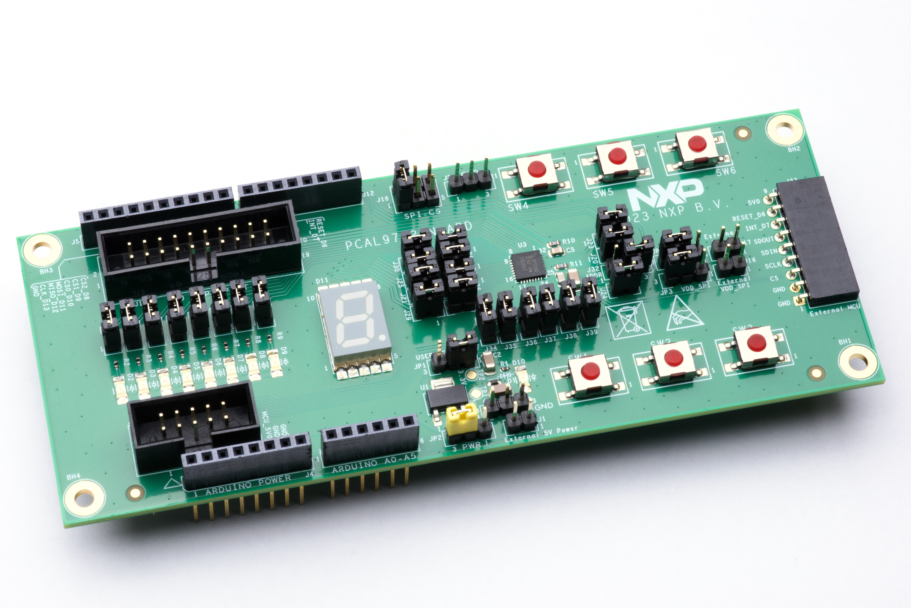
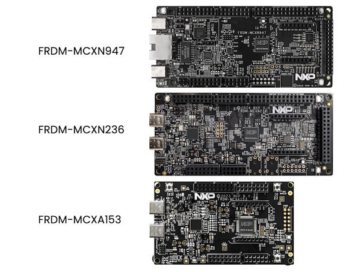
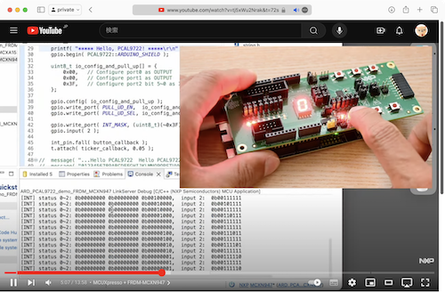

# PCAL9722HN-ARD operation sample
GPIO device operation sample code for MCX microcontrollers  
   
_PCAL9722HN-ARD : An Arduino® Shield Evaluation Boards for GPIO expander: PCAL9722_


## What is this?
An operation sample code for **[PCAL9722HN-ARD](https://www.nxp.com/part/PCAL9722HN-ARD)**.   
The **[PCAL9722](https://www.nxp.com/products/interfaces/ic-spi-i3c-interface-devices/general-purpose-i-o-gpio/22-bit-spi-i-o-expander-with-agile-i-o-features:PCAL9722)** is a 22-bit general purpose I/O expander that provides remote I/O expansion for most microcontroller families via the SPI interface. The ultra low-voltage interface allows for direct connection to a microcontroller operating down to 1.1 V.   
**PCAL9722HN-ARD** is an evaluation board to evaluate the PCAL9722. This sample code demonstrates its I/O and interruput function with NXP **MCX microcontrollers**.  

The sample code works on 3 types of FRDM-MCX boards: **[FRDM-MCXN947](https://www.nxp.com/design/design-center/development-boards-and-designs/general-purpose-mcus/frdm-development-board-for-mcx-n94-n54-mcus:FRDM-MCXN947)**, **[FRDM-MCXN236](https://www.nxp.com/design/design-center/development-boards-and-designs/general-purpose-mcus/frdm-development-board-for-mcx-n23x-mcus:FRDM-MCXN236)** and **[FRDM-MCXA153](https://www.nxp.com/design/design-center/development-boards-and-designs/general-purpose-mcus/frdm-development-board-for-mcx-a14x-a15x-mcus:FRDM-MCXA153)**.   

  
_FRDM-MCX board family : FRDM-MCXN947, FRDM-MCXN236 and FRDM-MCXA153_

## Getting started
### Video　guide
**Guide video** is available (It's in Japanese though)  
[](https://youtu.be/tj5xWu2Nrak?si=kFUAedvBVQvBRKxd)    
https://youtu.be/tj5xWu2Nrak?si=kFUAedvBVQvBRKxd

## Development tools
The code can be built on [MCUXpresso IDE](https://www.nxp.com/design/design-center/software/development-software/mcuxpresso-software-and-tools-/mcuxpresso-integrated-development-environment-ide:MCUXpresso-IDE)
- MCUXpresso IDE `v11.9.1` or `v11.10.0`

Use [MCUXpresso SDK](https://mcuxpresso.nxp.com/en/welcome) for each MCU boards
- FRDM-MCXN947: SDK `v2.14.0` or `v2.16.0`
- FRDM-MCXN236: SDK `v2.14.0` or `v2.16.0`
- FRDM-MCXN153: SDK `v2.14.2` or `v2.16.0`

## What's inside?
This sample code is including 9 projects for the MCUXpresso IDE.  
There are 2 types of application and one library for each MCX boards.  

Project name|Feature|Target MCU board
---|---|---
_r01lib_frdm_mcxa153	| Library: r01lib	|	FRDM-MCXA153
_r01lib_frdm_mcxn947	| Library: r01lib	|	FRDM-MCXN236
_r01lib_frdm_mcxn236	| Library: r01lib	|	FRDM-MCXN947
ARD_PCAL9722_basic_operation_FRDM_MCXA153	|	Sample application: Operate I/O ports by PCAL9722 register access	|	FRDM-MCXA153
ARD_PCAL9722_basic_operation_FRDM_MCXN236	|	Sample application: Operate I/O ports by PCAL9722 register access   |	FRDM-MCXN236
ARD_PCAL9722_basic_operation_FRDM_MCXN947	|   Sample application: Operate I/O ports by PCAL9722 register access	|	FRDM-MCXN947
ARD_PCAL9722_demo_FRDM_MCXA153	|   Sample application: Operate I/O ports and an interrupt by using PCAL9722 class in r01lib	|	FRDM-MCXA153
ARD_PCAL9722_demo_FRDM_MCXN236	|   Sample application: Operate I/O ports and an interrupt by using PCAL9722 class in r01lib	|	FRDM-MCXN236
ARD_PCAL9722_demo_FRDM_MCXN947	|   Sample application: Operate I/O ports and an interrupt by using PCAL9722 class in r01lib	|	FRDM-MCXN947

### Applications
#### ARD_PCAL9722_basic_operation_FRDM_MCXxnnn
This application shows a sample of PCAL9722 basic operation using it register accesses.  
Basic operation of the PCAL9722 are explained in the code: `source/main.cpp`.  

```cpp
#include	"r01lib.h"
#include	"pcal9722_registers.h"
...
SPI	spi( MOSI_PIN, MISO_PIN, SCLK_PIN, CS_PIN );

uint8_t	hardware_reset( bool address_setting );
void	register_write( uint8_t dev_addr, uint8_t reg_addr, uint8_t value );
uint8_t	register_read( uint8_t dev_addr, uint8_t reg_addr );

int main( void )
{
	printf( "***** Hello, PCAL9722! *****\r\n" );

	uint8_t	dev_addr	= hardware_reset( 0 );

	register_write( dev_addr, Configuration_port_0, 0x00 );	//	port 0 as output
	register_write( dev_addr, Configuration_port_1, 0x00 );	//	port 1 as output
	register_write( dev_addr, Configuration_port_2, 0x3F );	//	port 2 as input
...
..
void register_write( uint8_t dev_addr, uint8_t reg_addr, uint8_t value )
{
	uint8_t	w_data[ 3 ];
	uint8_t	r_data[ 3 ];

	w_data[ 0 ]	= dev_addr << 1;
	w_data[ 1 ]	= reg_addr;
	w_data[ 2 ]	= value;

	spi.write( w_data, r_data, 3 );
}

uint8_t register_read( uint8_t dev_addr, uint8_t reg_addr )
{
	uint8_t	w_data[ 3 ];
	uint8_t	r_data[ 3 ];

	w_data[ 0 ]	= (dev_addr << 1) | 0x1;
	w_data[ 1 ]	= reg_addr;
	w_data[ 2 ]	= 0;

	spi.write( w_data, r_data, 3 );

	return r_data[ 2 ];
}
```

#### ARD_PCAL9722_demo_FRDM_MCXxnnn
This application shows a demo of the **PCAL9722HN-ARD** board.  
The demo shows message on segment-LED and scanning pattern on line-LEDs.   
Pressing button generates interrupt and the button number will be shown on the segment-LED.  
The PCAL9722 is accessed via `gpio/PCAL9722` class in `r01lib`.  
`source/main.cpp`.  

```cpp
#include	"r01lib.h"
#include	"gpio/PCAL9722.h"
...

SPI			spi( D11, D12, D13, D10 );
PCAL9722	gpio( spi );
InterruptIn	int_pin( D7 );
...
..
int main( void )
{
	printf( "***** Hello, PCAL9722! *****\r\n" );
	gpio.begin( PCAL9722::ARDUINO_SHIELD );

	uint8_t io_config_and_pull_up[] = {
		0x00,	// Configure port0 as OUTPUT
		0x00,	// Configure port1 as OUTPUT
		0x3F,	// Configure port2 bit 5~0 as INTPUT
	};

	gpio.config( io_config_and_pull_up );					//  Port0, 1 and port2 are configured as output
	gpio.write_port( PULL_UD_EN,  io_config_and_pull_up );	//  Pull-up/down enabled for port2 bit 5~0
	gpio.write_port( PULL_UD_SEL, io_config_and_pull_up );	//  Pull-up selected for port2 bit 5~0
...
..
```

#### _r01lib_frdm_mcXNNN
`r01lib` is a library which is linked from applications.  
With this library, the MCU's GPIO pins, SPI bus and interrupts are abstracted with high level APIs.  
The `r01lib` is including device class library also. The PCAL9722 class is provided as a part of this.  

For API details, please refer to documents included in the project: `r01lib_docs/annotated.html`. 

